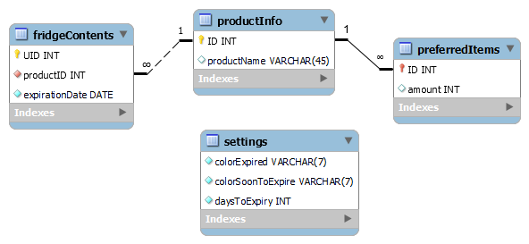

# Smart Fridge Management System
The Smart Fridge management system was made as the software support for the Smart Fridge project. Its main functionalities are the preview of products stored in the Smart Fridge, including their product name, expiration date, and quantity stored in the fridge at any given moment, as well as the management of an user-defined list of preferred products, which are products the user always wants to have in the fridge. Based on the list of preferred products, as well as the current quantity and expiration date of those products, the user can generate and print a shopping list straight from the app, simplifying the process of deciding what needs to be bought on your next trip to the grocery store.

## Smart Fridge
The Smart Fridge project was made as a graduation project at Technical school Ruđer Bošković in Zagreb, 2020. The project was inspired by the Amazon GO grocery stores. It used RFID tags attached to products to detect products being added or removed to the fridge.
The project was built on the Arduino Mega platform with a W5100 Ethernet shield to allow for communication with a XAMPP webserver on which the management system and the data stored in a MySQL database were hosted, an RFID-RC522 RFID reader for reading and writing to the tags attached to products, and a display system consisting of two LED diodes and a 16x2 LCD display.

<figure>
  
  <figcaption>Smart Fridge hardware in breadboarding phase</figcaption>
</figure>

## Database
The product information used by both software and hardware parts of this project is stored in a MySQL database hosted on a XAMPP server consisting of four tables:

**fridgeContents**, containing the information about the products currently stored in the fridge.

**productInfo**, pairing the product IDs to their names.

**preferredItems**, storing the user-defined list of products that should always be in the fridge.

**settings**, containing the user preferences such as the color they want the expired and soon to expire products to show up as, as well as the number of days before the expiry date during which the product is considered *soon to expire*

<figure>
  
  <figcaption>Database model (made in SQL Workbench)</figcaption>
</figure>

## Web application
The application frontend consists of two html pages - index.html and settings.html, which use JavaScript to generate lists of products, update user settings, and handle other miscellaneous application logic. The backend consists of PHP scripts for communication with the database, which are called by the frontend using AJAX.
